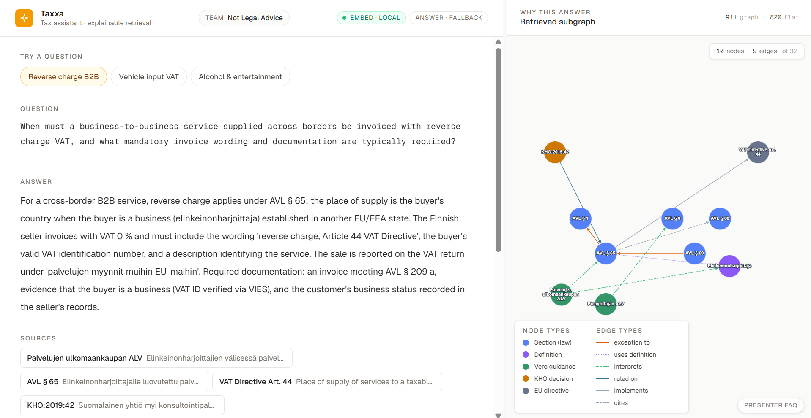
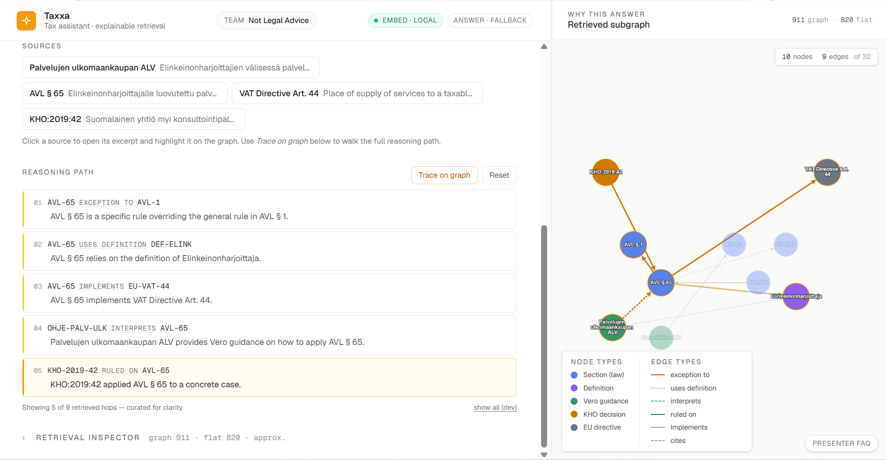
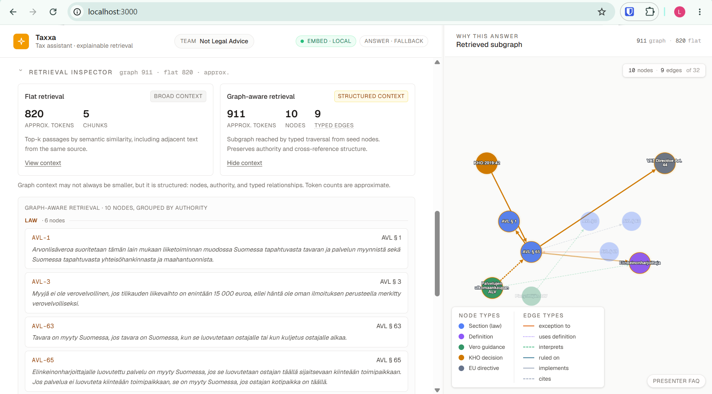
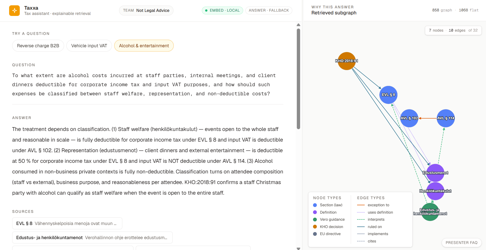

# Taxxa Graph Demo — Explainable Finnish Tax Retrieval

A chat-first prototype that answers Finnish tax questions by retrieving a
**typed legal subgraph** instead of a flat pile of text passages. Every
claim in every answer traces back to specific statute / guidance / case
nodes through typed legal relationships — and the user can inspect that
reasoning step-by-step on a live graph.

Built for the Aaltoes Hackathon · Taxxa challenge by team **Not Legal
Advice**.

---

## Screenshots

| | |
|---|---|
|  |  |
| Chat + retrieved subgraph side by side | A reasoning hop highlighted mid-trace |
|  |  |
| Inspector — flat ↔ graph comparison | A different query, different subgraph |

See [`screenshots/README.md`](screenshots/README.md) for the exact
state each shot is captured in.

---

## Problem statement

Generative tax assistants typically run plain RAG: chunk a legal corpus,
embed the chunks, top-k retrieve, stuff the passages into a prompt.
That works for surface-level questions but breaks down where tax law
actually lives:

- *Which* general rule does this specific provision carve out of?
- Which **definition** is this section relying on?
- Which **Vero guidance** interprets this statute?
- Which **KHO case** applied it in a concrete situation?
- Which **EU directive** is this Finnish statute implementing?

A flat chunk pack can quote text but it can't show the *structure* of
the legal argument. The reviewer is stuck trusting the LLM's synthesis
or re-reading the passages themselves.

This prototype reorganises retrieval around a typed knowledge graph so
that the relationships between rules are first-class. The answer comes
with a stepwise reasoning path of *typed legal hops*, every one of which
points at a real edge in `data/graph.json`.

---

## Architecture overview

```
   ┌──────────────────────┐
   │  user question       │
   └──────────┬───────────┘
              │
              ▼
   ┌──────────────────────┐         ┌─────────────────────────┐
   │  embedding           │ ◄────── │  Voyage / OpenAI / local │
   │  (query + nodes)     │         │  (priority: V > O > L)   │
   └──────────┬───────────┘         └─────────────────────────┘
              │ cosine
              ▼
   ┌──────────────────────┐
   │  top-3 seed nodes    │  (Section / Guidance / Case / Directive)
   └──────────┬───────────┘
              │
              ▼
   ┌──────────────────────┐
   │  depth-1 BFS         │  along 6 semantic edge types
   │  on typed graph      │
   └──────────┬───────────┘
              │
              ▼
   ┌──────────────────────┐
   │  retrieved subgraph  │  ≈ 8–11 nodes, ≈ 11–13 edges
   └──────────┬───────────┘
              │
       ┌──────┴───────┐
       ▼              ▼
   ┌─────────┐   ┌─────────────────┐
   │ guardrail│   │ score-based     │
   │ (per     │   │ curatePath()    │
   │ intent)  │   │ (top-up)        │
   └────┬─────┘   └────────┬────────┘
        └────────┬─────────┘
                 ▼
   ┌──────────────────────┐
   │  curated reasoning   │  4–6 typed hops, narratively ordered
   │  path                │
   └──────────┬───────────┘
              │
              ▼
   ┌──────────────────────┐         ┌─────────────────────────┐
   │  answer              │ ◄────── │  Sonnet 4.6 (if         │
   │  (grounded in        │         │  ANTHROPIC_API_KEY) /   │
   │  subgraph + path)    │         │  canned fallback        │
   └──────────────────────┘         └─────────────────────────┘
```

**Graph traversal is the innovation layer.** Voyage produces vectors,
Sonnet produces prose; the typed subgraph + curated path are what make
the answer *explainable*. Swapping the embedding backend changes seed
quality; swapping the answer backend changes wording; neither changes
the typed reasoning structure.

---

## How retrieval works

1. **Embed.** Compute embeddings for every visible graph node (cached
   per process) and for the user query. With `VOYAGE_API_KEY` set we
   call `voyage-3.5-lite` (multilingual, fast, cheap). Without it we
   fall back to OpenAI `text-embedding-3-small`, then to a zero-dep
   local hashed-n-gram backend.
2. **Top-k seed selection.** Cosine similarity between the query and
   each `Section / VeroGuidance / KHO_Decision / EUDirective` node;
   top-3 become BFS seeds.
3. **BFS subgraph assembly.** Depth-1 BFS along six **semantic** edge
   types: `EXCEPTION_TO`, `CITES`, `USES_DEFINITION`, `INTERPRETS`,
   `RULED_ON`, `IMPLEMENTS`. Structural edges (`CONTAINS`) and
   administrative edges (`APPLIES_TO_FORM`, `AMENDS`, `SUPERSEDES`)
   are ignored — they don't add reasoning value.
4. **Subgraph augmentation + prune.** Anchor nodes one hop from the
   guardrail edges are pulled in only if at least one endpoint is
   already in the BFS result. The subgraph is then capped to ≤10 nodes
   so the inspector stays readable.
5. **Reasoning path.** A per-intent **guardrail** orders the visible
   hops in a way that reads as a clean legal argument. Edges that
   aren't actually in the retrieved subgraph are silently skipped —
   never fabricated. If the guardrail returns < 4 hops, a score-based
   `curatePath()` tops up from the dynamic subgraph.
6. **Answer.** When `ANTHROPIC_API_KEY` is set, Sonnet 4.6 generates
   the prose grounded in the serialized subgraph + reasoning path.
   Otherwise the per-intent canned answer is served. Failures (timeout
   /network/empty response) fall back silently.

Everything visible in the UI is grounded in `data/graph.json`. Nothing
fabricates an edge or a node that isn't there.

---

## Why graph-aware retrieval matters

- **Structure.** Typed nodes carry authority (`law`, `directive`,
  `guidance`, `case`). Typed edges carry legal relationships
  (`EXCEPTION_TO`, `USES_DEFINITION`, `INTERPRETS`, `RULED_ON`,
  `IMPLEMENTS`, `CITES`). The curated path is a sequence of these
  relationships, not a paragraph of prose.
- **Auditability.** A reviewer can walk every step on the graph
  canvas, click any node to read its source excerpt, and verify each
  typed hop against `data/graph.json`. There is no "trust the model
  on this passage" step.
- **Reasoning, not just retrieval.** "*This answer holds because AVL
  § 65 is an exception to AVL § 1, uses the definition of
  elinkeinonharjoittaja, implements EU VAT Directive Art. 44, and was
  applied in KHO:2019:42.*" A flat chunk pack cannot say that.

**What this is *not*:** a claim of guaranteed lower tokens per query.
The Retrieval inspector applies the same character-based token
heuristic to both the flat-chunk pack and the serialized subgraph; for
some queries the graph context is comparable to or slightly larger
than a tight flat pack. The headline is the *shape* of the context,
not raw savings. Token savings emerge when typed traversal lets you
swap a broad chunk pack for a tight subgraph, but that's a
side-effect of structure.

---

## What is real (runs live per query)

- **Embeddings** (Voyage / OpenAI / local).
- **Cosine seed selection** over visible graph nodes.
- **Typed BFS subgraph assembly**.
- **Subgraph augmentation + prune**.
- **Sonnet 4.6 answer generation** when `ANTHROPIC_API_KEY` is set.
- **Citation chips** drawn from the retrieved subgraph, ranked by
  query similarity.
- **Token metrics** (graph + flat) computed by serializing the
  prompt-like context each method would assemble and applying the
  same `approxTokens` heuristic to both. Approximation, not BPE —
  but identical heuristic on both sides for honest comparison.
- **Full BFS path** is always inspectable via the *show all (dev)*
  toggle.

## What is curated (deterministic)

- **Three demo guardrails** that order the visible reasoning path per
  query intent — applied only where the edges *exist* in the retrieved
  subgraph.
- **Three canned fallback answers**, one per intent, served when
  Sonnet is unavailable so the demo stays reproducible offline.
- **Five simulated flat-retrieval chunks per intent** for the
  inspector's flat-vs-graph comparison.

## Limitations (out of scope)

- **Not production-scale legal correctness.** The graph has ~30
  hand-curated nodes covering statutes, EU directive articles, Vero
  guidance, KHO cases, and a handful of definitions. The real Finnish
  tax corpus has thousands of provisions and rulings. No inference
  here generalises beyond the three scripted query patterns.
- **Source excerpts are paraphrased and shortened.** They are not a
  substitute for the canonical Finlex / Vero source documents.
- **KHO decision identifiers are plausibly shaped** (e.g.
  `KHO:2019:42`) and the wording of the excerpts is illustrative, not
  lifted verbatim. They exist to show how the retrieval surfaces case
  authority, not as citable sources.
- **No ingestion pipeline.** Graph and excerpts are hand-curated.
- **No authentication, persistence, or multi-tenant infrastructure.**
- **No claim that graph context is always smaller** than flat context.
  The inspector shows token budgets honestly on both sides.

---

## How to run

API keys are **optional in every mode** — the demo runs end-to-end on
local hashed embeddings + canned per-intent answers when no keys are
set. All three modes serve the app at <http://localhost:3000>.

### 1. Local — without Docker

Prerequisites: Node 20+ and npm.

```bash
cd taxxa-graph-demo
npm install
npm run dev
```

### 2. Docker (single container)

Prerequisites: Docker.

```bash
cd taxxa-graph-demo
cp .env.example .env          # optional — keys are optional
docker build -t taxxa-graph-demo .
docker run --rm -p 3000:3000 --env-file .env taxxa-graph-demo
```

### 3. Docker Compose (recommended for reproduction)

Prerequisites: Docker with the Compose plugin.

```bash
cd taxxa-graph-demo
cp .env.example .env          # optional — keys are optional
docker compose up --build
```

### Optional — API keys

Add any combination of these to `.env` (for Docker) or `.env.local`
(for local dev) and restart. None are required.

```bash
# Voyage embeddings (retrieval). Preferred over OpenAI when both are set.
VOYAGE_API_KEY=

# Optional: override the default Voyage model. Default is voyage-3.5-lite
# (strong multilingual retrieval, cheap and fast — a good fit for English
# queries over Finnish source text). Other valid values include
# voyage-3 and voyage-3-large.
VOYAGE_MODEL=voyage-3.5-lite

# OpenAI embeddings (retrieval). Used only if VOYAGE_API_KEY is absent.
OPENAI_API_KEY=

# Claude Sonnet 4.6 (answer generation). Independent of the embeddings
# choice — you can run Voyage + Sonnet, local + Sonnet, Voyage + canned
# answers, etc.
ANTHROPIC_API_KEY=
```

The header surfaces two badges: `embed · {voyage|openai|local}` and
`answer · {sonnet|fallback}`. The guardrail, the curated reasoning
path, and the retrieved subgraph stay identical across configurations.

### Fallback mode

The app degrades gracefully at every layer:

| When … | The demo … |
|---|---|
| No `VOYAGE_API_KEY` and no `OPENAI_API_KEY` | Embeds with the local hashed-n-gram backend (zero deps). |
| No `ANTHROPIC_API_KEY` | Serves the per-intent canned answer (still grounded against the same subgraph + reasoning path). |
| Sonnet call times out / errors / returns empty | Silently falls back to the canned answer; logs a warning server-side. |
| `/api/ask` itself fails | The page renders the canned fallback for the active intent. |

This means the same `docker compose up --build` reproduces the demo
on an air-gapped machine with no surprises.

---

## Demo walkthrough

1. Open <http://localhost:3000>.
2. Click one of the three suggested-question pills at the top of the
   chat pane (see *The three queries* below). The pipeline runs end
   to end.
3. **Answer** appears below the question, grounded in the retrieved
   subgraph.
4. **Sources** strip shows 3–4 citation chips drawn from the subgraph
   and ranked by query similarity. Click any chip → its full excerpt
   opens inline and the node lights up on the graph.
5. **Reasoning path** lists 4–6 typed hops in narrative order. Each
   row is clickable: click row N → that one edge + its endpoints
   focus on the graph canvas. Hover any edge label (e.g. `exception
   to`) for a plain-English tooltip explaining the edge type. The
   "Trace on graph" button walks the full sequence.
6. **Graph canvas** on the right shows the retrieved subgraph,
   coloured by node type and edge type. Click any node → its source
   excerpt opens inline (same surface as the citation chips). The
   bottom-left legend shows both node and edge type keys.
7. **Retrieval inspector** is a collapsed `<details>` block above the
   sources. Expanding it surfaces approximate token budgets for both
   flat and graph retrieval, with "View context" panels showing the
   exact prompt-like context each method would assemble.
8. **Resize** the chat / graph panes by dragging the divider between
   them.
9. **Presenter FAQ** pill in the bottom-right (or press `?`) opens a
   searchable drawer with short, judge-ready answers to common
   questions.

### Direct API check

```bash
curl -s -X POST http://localhost:3000/api/ask \
  -H "Content-Type: application/json" \
  -d '{"query":"<one of the three questions>"}' | jq .
```

Response shape (`AskResponse`, see `lib/types.ts`):

```ts
{
  query, intent, answer,
  citations,    // 3–4 chips drawn from the visible path
  path,         // curated 4–6 hops (guardrail + curator fallback)
  fullPath,     // every semantic edge BFS reached
  subgraph,     // { nodeIds, edgeIds } from BFS + augmentation + cap
  flatChunks,   // simulated flat-retrieval passages for this intent
  metrics,      // tokens, counts, seeds, embeddingMethod, answerProvider
  source        // "live" | "fallback"
}
```

Everything in `path` and `citations` lives in `subgraph`; everything
in `subgraph` lives in `data/graph.json`.

---

## The three queries

| # | Topic | Question |
|---|---|---|
| 1 | Reverse-charge B2B services | *"When must a business-to-business service supplied across borders be invoiced with reverse charge VAT, and what mandatory invoice wording and documentation are typically required?"* |
| 2 | Passenger car / van input VAT | *"Under what conditions is input VAT on passenger cars and vans deductible when the vehicles are partly used for private driving, including company cars, pickup trucks, and service vans driven between home and customer sites?"* |
| 3 | Alcohol / staff party / client dinner | *"To what extent are alcohol costs incurred at staff parties, internal meetings, and client dinners deductible for corporate income tax and input VAT purposes, and how should such expenses be classified between staff welfare, representation, and non-deductible costs?"* |

Each question is exposed as a clickable pill in the UI. Clicking
re-runs the entire retrieval pipeline.

---

## File map

```
data/
  graph.json                   ~30 nodes, ~60 edges; positions, aliases,
                               paraphrased Finnish source excerpts
app/
  page.tsx                     UI — chat, sources, reasoning path,
                               retrieval inspector, graph pane,
                               resizable divider, FAQ
  api/ask/route.ts             Embed → top-k seeds → BFS → augment →
                               prune → guardrail/curate → citations →
                               Sonnet generation (optional)
  globals.css                  Locked light theme + typography
  layout.tsx                   Root layout
components/
  Canvas.tsx                   Cytoscape.js wrapper (node tap,
                               highlight, fit, light theme)
  PresenterFAQ.tsx             Presenter-only Q&A drawer ("?")
lib/
  types.ts                     Shared types (Graph, AskResponse, …)
  embeddings.ts                Voyage / OpenAI / local dispatcher
  retrieval.ts                 cosine, topK seeds, BFS, augment,
                               prune, curatePath, serializeFlatContext,
                               serializeGraphContext, approxTokens
  demo-guardrails.ts           Three intents + ordered narrative edges
  flat-chunks.ts               Per-intent simulated flat chunks
  fallback-data.ts             Per-intent canned response + QUERIES
  answer-gen.ts                Optional Sonnet 4.6 generation w/ timeout
Dockerfile                     Multi-stage build → standalone runtime
docker-compose.yml             One-command reproduction
.env.example                   Optional API keys, with comments
```

---

## Future work (intentionally not in this prototype)

- **Real ingestion pipeline** that parses Finlex XML, Vero guidance
  HTML, and KHO decisions into the typed graph automatically.
- **Amendment / version propagation** — the `AVL-3-v2` and
  `HE-142-2026` hidden nodes are sketched for this; surfacing them
  cleanly needs a version-aware retrieval policy.
- **Prompt caching on the graph schema** — the system prompt + node
  ontology is stable across queries and would cache well on the
  Anthropic Messages API.
- **Per-intent token cost telemetry** tracked over a real query
  stream so the inspector reports real model-side counts, not the
  approximate heuristic.
- **Agentic traversal** — turning each typed edge into a tool call
  that an agent plans against, with the curated path as the audit
  trail.
- **Authentication, persistence, multi-user.**
- **Cross-jurisdiction support** beyond Finland.

None of these are needed for the architectural demonstration above.
